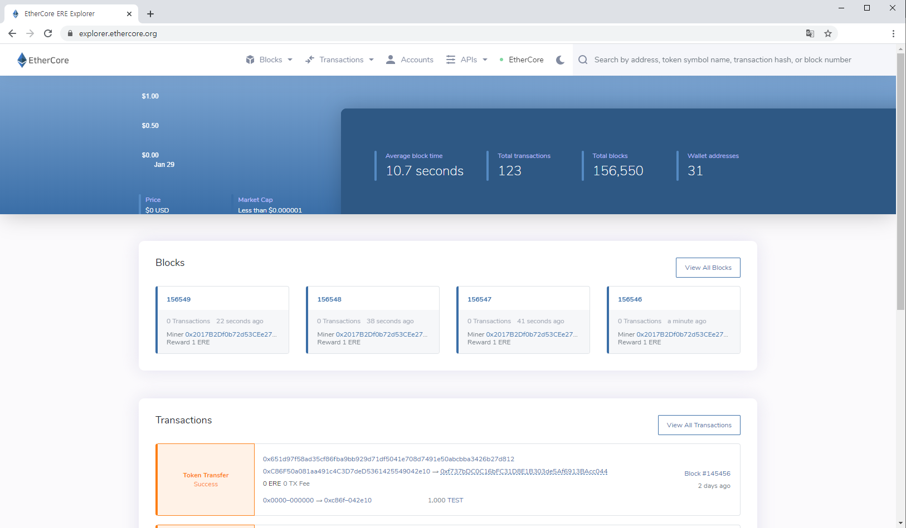

# Welcome to EtherCore

EtherCoreDocs introduces and explains [EtherCore](https://ethercore.org), a multi-chain decentralized application and smart contracts platform that hosts various applications that can be used in real world. In the following documents, we describe what EtherCore is and provide guidelines and instructions on how to use EtherCore as well as how to interact with the EtherCore network. To better understand EtherCore's vision, mission, and future plans briefly, please read the [EtherCore White Paper](./whitepaper/new-ethercore-whitepaper-v1.8.1.pdf)

**Disclaimer:** Some notes are derived from Ethereum documents as the EtherCore source code was initiated from Ethereum’s Istanbul version. As EtherCore develops further, EtherCoreDocs and the source code will continue to be updated. Reference websites are as follows:

+ https://github.com/ethereum/go-ethereum/wiki
+ https://truffleframework.com/docs
+ https://web3js.readthedocs.io/en/1.0/

## One Pager

[EtherCore One Pager](./onepager/EtherCore-One-Pager.pdf)

## Whitepaper

[Whitepaper](./whitepaper/EtherCore-Whitepaper.pdf)

## Manual

[How to run EtherCore Node](./manual/EtherCore-Node-Manual.pdf)

[How to use EtherCore Testnet](./manual/How-to-use-EtherCore-Testnet.pdf)

[How to connect EtherCore mainnet with Metamask](./manual/How-to-connect-EtherCore-mainnet-with-Metamask.pdf)

[How to generate EtherCore Wallet and obtain EtherCore wallet address](./manual/How-to-generate-EtherCore-Wallet-and-obtain-EtherCore-wallet-address.pdf)

[How to lockup EtherCore coins](./manual/How-to-lockup-EtherCore-coins.pdf)

[How to mine EtherCore with your own GPU](./manual/How-to-mine-EtherCore-with-your-own-GPU.pdf)

[How to send EtherCore coins from EtherCore Web Wallet](./manual/How-to-send-EtherCore-coins-from-EtherCore-Web-Wallet.pdf)

[How to develop ERC20 token on EtherCore mainnet](./manual/How-to-develop-ERC20-token-on-EtherCore-mainnet.pdf)
